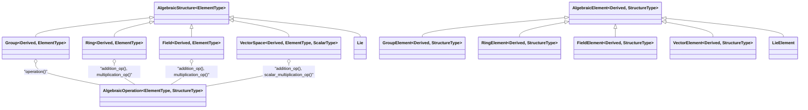

# Abstract Algebra Class Architecture

This diagram illustrates the actual class architecture of the abstract algebra module in cppmath, based on the C++ code. Each algebraic structure (e.g., Group, Ring, Field, VectorSpace, Lie) is a template class inheriting from a common base, and each has a corresponding element type. Operations are abstracted via the AlgebraicOperation class.

---

---

**Explanation:**
- `AlgebraicStructure` is the root template for all algebraic structures.
- `Group`, `Ring`, `Field`, `VectorSpace`, and `Lie` are all direct children of `AlgebraicStructure`.
- `AlgebraicElement` is the root for all element types, with each structure having a corresponding element type inheriting from it.
- `AlgebraicOperation` is a template for operations (e.g., addition, multiplication, group operation) and is used by the structures to define their core operations.
- There are no separate "finite" base classes; concrete implementations (like `FiniteField`) are specific classes, not part of the abstract hierarchy.

This modular design allows for extensibility and code reuse across different algebraic structures, with operations abstracted and injected as needed. 